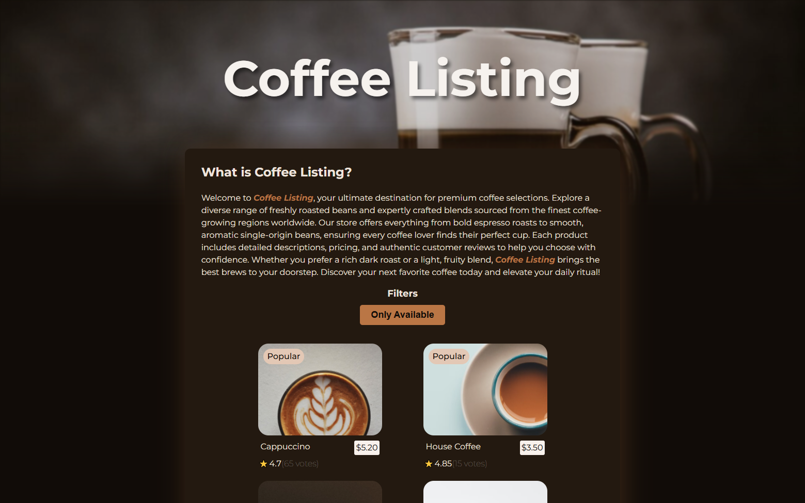
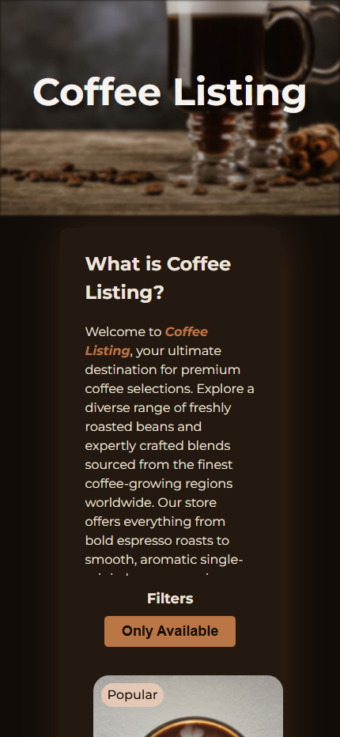
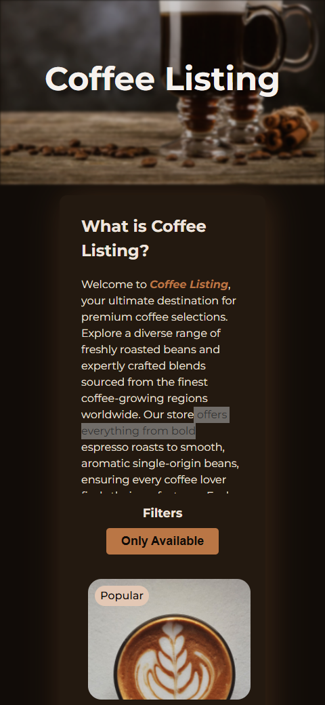

<a name="readme-top"></a>

<div align="center">

![Typescript][typescript]
![React][react]
![Vite][vite]
![Prettier][prettier]

[![contributions][contributions]](https://github.com/IvanHurtado92/Coffee-Listing/graphs/contributors)
[![commits][commits]](https://github.com/IvanHurtado92/Coffee-Listing/commits)
[![repo-size][repo-size]](https://github.com/IvanHurtado92/Coffee-Listing)



## ☕ Coffee Listing

<p align="left">
<em>Coffee Listing</em> is a web application designed to help you discover the perfect coffee for your taste, featuring a fresh and intuitive interface. This project is part of a larger initiative for <strong>educational purposes, aimed at gaining deeper knowledge of React and TypeScript</strong>.
</p>

</div>

<details>
	<summary>Table of Contents</summary>

- [☕ Coffee Listing](#-coffee-listing)
- [🚀 Features](#-features)
  - [📸 Screenshots](#-screenshots)
    - [iPhone 14 Pro Max](#iphone-14-pro-max)
    - [Pixel 7 Pro](#pixel-7-pro)
- [📦 Installation](#-installation)
- [💅 Prettier](#-prettier)
- [👨‍💻 Contributors](#-contributors)

</details>

## 🚀 Features

- **Responsive Design 📱 💻**: The application is designed to provide an optimal user experience on various devices, ensuring a seamless browsing experience.
- **Intuitive Interface 💡**: The interface is user-friendly, making it easy for users to navigate and find the desired coffee.
- **API Integration 🌐**: The application integrates with an API to fetch coffee data.

### 📸 Screenshots

#### iPhone 14 Pro Max


#### Pixel 7 Pro


## 📦 Installation

To install the application, follow these steps:

1. Clone the repository:

```bash
git clone https://github.com/IvanHurtado92/Coffee-Listing.git
```

2. Install the dependencies:

```bash
npm install
```

3. Run the application:

```bash
npm run dev
```

## 💅 Prettier

This project uses [Prettier](https://prettier.io/) to format the code, ensuring a consistent code style across the project.

> If you're using **Visual Studio Code**, you can install the Prettier extension to automatically format your code as you type.

Prettier configuration is located in the `.prettierrc` file, here are the settings:

```json
{
  "singleQuote": false,
  "semi": false,
  "singleAttributePerLine": true,
  "tabWidth": 2,
  "useTabs": false,
  "jsxSingleQuote": true
}
```

## 👨‍💻 Contributors

This was a project that was created for improvement and learning purposes.

**Thanks to all the contributors who have helped make this project!**

<a href="https://github.com/MauriRiver345/WhatDoesItMean/graphs/contributors">
  
</a>

<p align="right">(<a href="#readme-top">Back to top</a>)</p>

[contributions]: https://img.shields.io/github/contributors/MauriRiver345/WhatDoesItMean?style=for-the-badge
[commits]: https://img.shields.io/github/commit-activity/t/MauriRiver345/WhatDoesItMean?style=for-the-badge
[repo-size]: https://img.shields.io/github/repo-size/MauriRiver345/WhatDoesItMean?style=for-the-badge
[typescript]: https://img.shields.io/badge/Typescript-blue?style=for-the-badge&logo=Typescript&logoColor=white
[react]: https://img.shields.io/badge/React-blue?style=for-the-badge&logo=React&logoColor=white
[vite]: https://img.shields.io/badge/Vite-8A2BE2?style=for-the-badge&logo=Vite&logoColor=white
[prettier]:https://img.shields.io/badge/Prettier-blue?style=for-the-badge&logo=Prettier&logoColor=white
